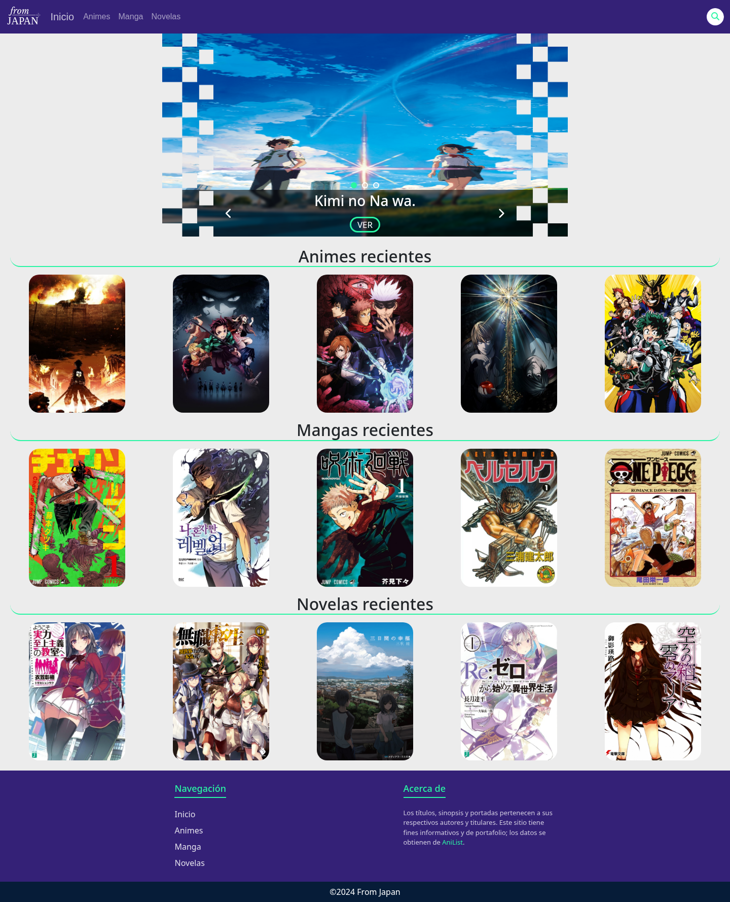
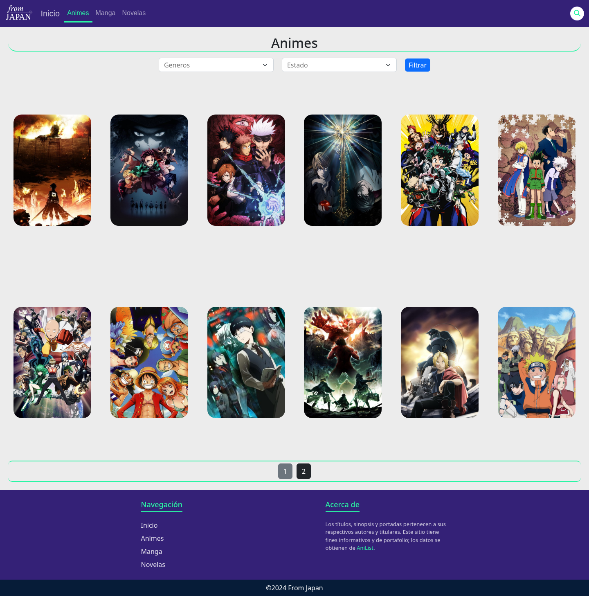
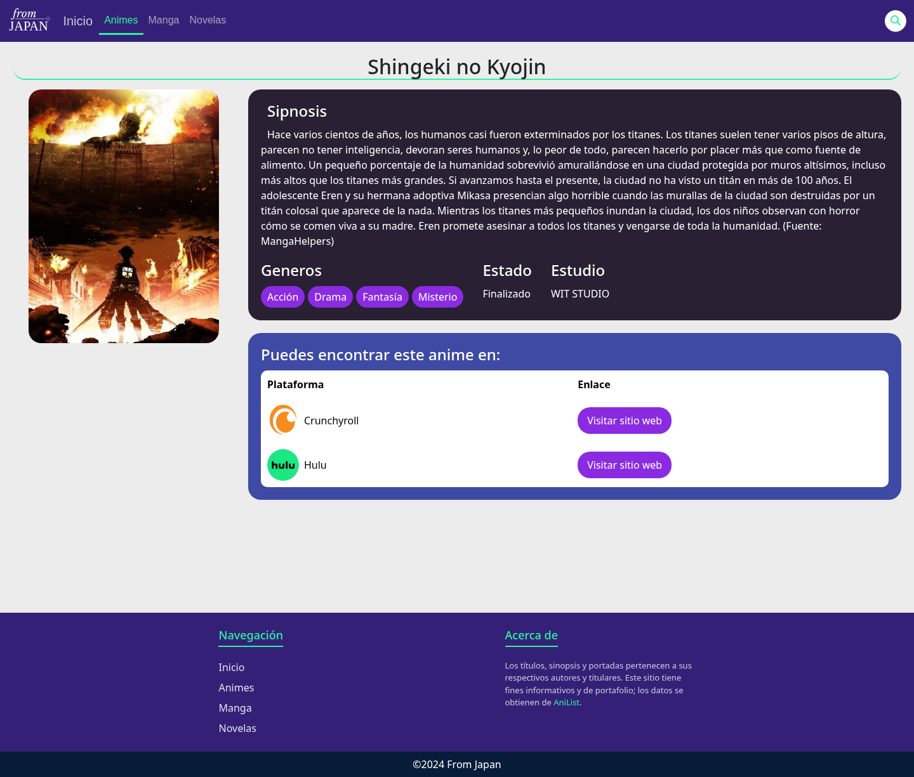
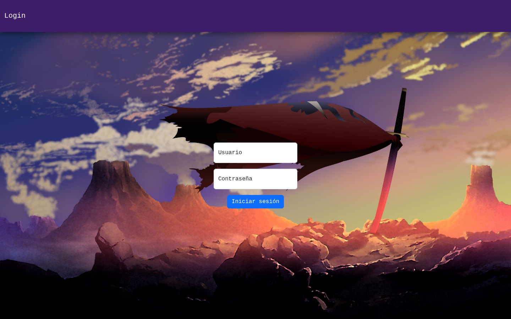

<p align="center">
  
</p>

<h1 align="center"> From Japan </h1>

<p align="center">
  <b>Full-stack catalog</b> of Japanese entertainment — anime, manga and light novels.
  Public site with search, filters and pagination, plus an admin panel to manage
  articles, genres and the home carousel — populated with <b>real data from AniList</b>.
</p>

<p align="center">
  <a href="https://github.com/Axforzi/fromJapan/actions"></a>
  
  
  
</p>

<p align="center">
  Live demo: <a href="https://fromjapan.onrender.com" target="_blank">fromjapan.onrender.com</a>
</p>

---

## Why this project

This is a portfolio case study of a **full-stack product** built on the "happy path"
workflows a real company relies on: fetching external data, transforming it for a
local audience, exposing it through a clean public UI, and letting operators manage it
through a secured admin panel. The most interesting parts are the data pipeline and
the engineering decisions behind making third-party data production-ready.

## Features

### Public site
- Home carousel + recent articles per category.
- Paginated listings for anime, manga and light novels.
- Filters by genre and status.
- Full-text search (MongoDB text index).
- Detailed article page with cover, synopsis, genres and **verified store links with logos**.

### Admin panel
- Login with hashed passwords (Werkzeug pbkdf2-sha256).
- Full CRUD for articles (with validated cover uploads), genres and carousel.
- All routes protected with `@login_required`.

## Screenshots

| | |
|---|---|
| Home | Animes listing |
|  |  |
| Article detail | Admin login |
|  |  |

## Tech stack

- **Backend:** Flask 3 + MongoDB (MongoEngine ODM).
- **Frontend:** Jinja2 + Bootstrap 5 + Font Awesome + vanilla JavaScript.
- **Auth:** Flask-Login with Werkzeug password hashing.
- **Data:** AniList GraphQL API.
- **Deploy:** waitress + nginx on Linux (Render).

## Architecture

```
                ┌──────────────────────────────────────────┐
                │              AniList (GraphQL)             │
                └──────────────────────┬───────────────────┘
                                       │ seed.py (CLI script)
                ┌──────────────────────▼───────────────────┐
                │        MongoDB (Atlas/local)              │
                │   articles · genres · carousel · users    │
                └──────────────────────┬───────────────────┘
                                       │ MongoEngine ODM
        ┌──────────────────────────────▼───────────────────────────────┐
        │                         Flask app                            │
        │   routes/ (blueprints)  →  services/ (business logic)        │
        └───────┬──────────────────────────────┬───────────────────────┘
                │  public: / /animes /mangas    │  admin: /admin (login)
                │  /novelas /buscar/<q> /ficha   │  /login /logout
        ┌───────▼──────────────────────────────▼───────────────────────┐
        │  Templates (Jinja2) + static CSS/JS — responsive UI          │
        └──────────────────────────────────────────────────────────────┘
```

Routes stay thin; all the heavy lifting lives in `services/`, which keeps the app
easy to test and evolve — and is what most of the integration tests target.

## Key engineering decisions

### 1. Seeding real data from AniList
`seed.py` queries the public [AniList GraphQL API](https://anilist.co/graphql)
for the 15 most popular titles per category and saves real covers, synopses and
metadata. It is idempotent (skips existing titles) and supports `--clean`.

### 2. Spanish localization pipeline
Catalog copy is in Spanish even though AniList serves English:
- HTML is stripped and whitespace collapsed before translation.
- **Primary:** Google Translate's free `gtx` endpoint (one call for the whole text).
- **Fallback:** MyMemory (free tier caps ~500 chars/request) by splitting the text
  into fragments at word boundaries and rejoining.
- Every synopsis is **capped at 2000 characters** cut at the last word boundary,
  so no sentence is ever split or truncated mid-word.

### 3. Trusted, region-aware store links with logos
Not every `externalLink` on AniList is useful — many are regional or niche stores.
`extraer_links()`:
- Keeps only a **whitelist** of platforms per category (Crunchyroll/Netflix/Hulu/Prime
  for anime; VIZ/Yen Press/Kodansha/Seven Seas/MANGA Plus/Amazon/Google Play/Kobo for
  manga and novels).
- **Drops URLs whose path is in a non EN/ES locale** (`/fr/`, `/de/`, `/ja/`, ...);
  AniList only links to non-ES EU stores even for Spanish-speaking users.
- **Downloads a logo per trusted platform** to `static/img/logos/`, inferring the real
  extension from the response `Content-Type` and caching so it never re-hits network
  rate limits.
- Dedupes and caps at 6 links per article.

### 4. Full-text search
MongoDB text index over title + synopsis powers `/buscar/<q>`, with optional
genre/status filters and pagination.

### 5. Security
- Passwords hashed with `generate_password_hash` (pbkdf2-sha256); never stored in plain.
- Uploads validated by extension and sanitized with `secure_filename`.
- Admin routes gated behind `@login_required` (session-based).
- Secrets (`SECRET_KEY`, `MONGO_URI`) come only from environment variables.

## Getting started

```bash
# 0. Prerequisite: uv (package manager) — https://docs.astral.sh/uv/

# 1. Clone and enter
git clone https://github.com/Axforzi/fromJapan
cd fromJapan

# 2. Install dependencies and create the environment (.venv)
uv sync --dev

# 3. Configure environment variables
cp .env.example .env        # fill SECRET_KEY and MONGO_URI

# 4. Initialize the database (admin + 45 real articles from AniList)
uv run python seed.py

# 5. Run
uv run python app.py                                    # development
uv run waitress-serve --listen 0.0.0.0:8080 app:app     # production
```

## Tests

```bash
uv run pytest -q
```

The suite covers unit tests for the seeding/tokenization helpers (always run) and
**integration tests** for the routes, JSON services, search and the full admin
auth + CRUD flow (these require a real MongoDB, e.g. `docker run -p 27017:27017 mongo:7`).

Continuous integration on GitHub Actions spins up a MongoDB service container and
runs the whole suite on every push and pull request — see
[`.github/workflows/ci.yml`](.github/workflows/ci.yml).

## Project structure

```
├── app.py              # Flask app entry point
├── seed.py             # Populates the DB from AniList (translation, links, logos)
├── pyproject.toml      # Dependencies & config (uv)
├── .env.example        # Env var template
├── routes/             # Blueprints: index, admin, login
├── services/           # Business logic (separate from routes)
├── schema/             # MongoEngine models
├── templates/          # Jinja2 templates
├── static/             # CSS, JS, images
├── tools/screenshots.py# Playwright script to capture portfolio screenshots
└── tests/              # pytest suite
```

## License

Personal project built for portfolio purposes.